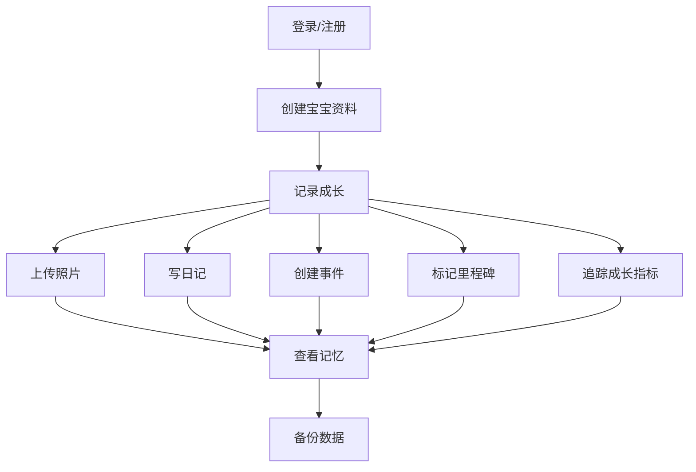

# BabyMemo 产品需求文档

## 1. Product Overview

BabyMemo 是一个专为家庭设计的宝宝成长记录系统，帮助家长记录和管理宝宝成长过程中的重要时刻、照片、日记和里程碑事件。
- 旨在为家庭提供一个美观、实用、私密的成长记录平台，让珍贵记忆永久保存
- 目标是成为家长记录宝宝成长的首选工具，通过美观的界面和丰富的功能提升用户体验

## 2. Core Features

### 2.1 User Roles

| Role | Registration Method | Core Permissions |
|------|---------------------|------------------|
| Parent User | Username/Password registration | Full access to all features, manage multiple babies, data backup/restore |

### 2.2 Feature Module

1. **Home Page**: Welcome hero section, quick access cards, recent memories preview
2. **Photo Wall**: Grid photo gallery, upload functionality, tags/filters, slideshow mode
3. **Creative Diary**: Rich text editor, media insertion, mood/weather tags, search/filter
4. **Creative Calendar**: Monthly view, event creation, milestone marking, reminders
5. **Timeline**: Vertical chronological display, milestone cards, media-rich entries
6. **Baby Management**: Baby profile creation, growth tracking, multiple babies support
7. **Growth Indicators**: Height/weight tracking, growth charts, standard comparison
8. **Video Management**: Video gallery, upload/preview, thumbnail generation
9. **Settings**: Theme customization, data backup/restore, user profile

### 2.3 Page Details

| Page Name | Module Name | Feature description |
|-----------|-------------|---------------------|
| Home Page | Hero Section | Animated gradient background, app title with playful typography, tagline |
| Home Page | Quick Access Cards | Colorful cards for each main feature with icons and hover effects |
| Home Page | Recent Memories | Horizontal scrollable preview of latest photos/diaries/milestones |
| Photo Wall | Photo Grid | Masonry-style responsive grid with smooth animations and hover effects |
| Photo Wall | Upload Modal | Drag-and-drop upload area, metadata input, tag/category selection |
| Photo Wall | Slideshow | Full-screen slideshow with transition effects, auto-play, keyboard navigation |
| Creative Diary | Diary List | Card-based layout with date grouping, search bar, filter dropdown |
| Creative Diary | Rich Text Editor | Modern WYSIWYG editor with toolbar, media upload, emotion picker |
| Creative Calendar | Calendar View | Interactive monthly calendar with colored dots for events, swipe navigation |
| Creative Calendar | Event Form | Modal form with date picker, event type selection, color customization |
| Timeline | Timeline View | Vertical timeline with alternating side cards, smooth scroll animations |
| Timeline | Milestone Form | Detailed form with date, title, description, media upload, tags |
| Baby Management | Baby Profile | Cute profile card with avatar, birth details, quick stats |
| Growth Indicators | Chart View | Interactive line charts with tooltips, comparison lines, date range selection |
| Settings | Theme Selector | Multiple color themes with preview, dark/light mode toggle |

## 3. Core Process

**Primary User Flow**:
1. User registers/logs in to access the system
2. User creates one or more baby profiles
3. User uploads photos, writes diaries, creates events, and marks milestones
4. User can view all memories in various formats (grid, calendar, timeline)
5. User tracks growth indicators and views progress charts
6. User regularly backs up data to prevent loss

## 4. User Interface Design

### 4.1 Design Style
- **Primary Colors**: Soft Coral (#FF6B6B), Mint Green (#4ECDC4), Warm Yellow (#FFE66D)
- **Secondary Colors**: Lavender (#E2D1F9), Sky Blue (#A7DBD8), Peach (#FFDAB9)
- **Button Style**: Rounded pill buttons with soft shadows, gradient backgrounds, hover animations
- **Fonts**: Display font - "Quicksand" (playful yet clean), Body font - "Poppins" (high readability)
- **Layout Style**: Card-based with generous spacing, organic shapes, subtle gradients
- **Icon Style**: Cute, hand-drawn style icons with rounded corners and soft colors

### 4.2 Page Design Overview

| Page Name | Module Name | UI Elements |
|-----------|-------------|-------------|
| Home Page | Hero Section | Gradient mesh background, floating bubbles animation, large playful typography |
| Home Page | Quick Access Cards | Colorful cards with icons, hover lift effect, subtle patterns |
| Photo Wall | Photo Grid | Masonry layout with photo overlays, caption on hover, smooth transitions |
| Creative Diary | Diary List | Date-separated cards with cute dividers, emoji mood indicators, photo previews |
| Creative Calendar | Calendar View | Large calendar cells, colored event dots, hover tooltips, swipe animations |
| Timeline | Timeline View | Vertical connecting line, alternating cards, animated scroll reveal, media previews |
| Baby Management | Baby Profile | Avatar with decorative frame, stat badges, playful background pattern |
| Growth Indicators | Chart View | Smooth line graphs, interactive tooltips, color-coded indicators |
| Settings | Theme Selector | Theme cards with live preview, animated transitions, clear visual feedback |

### 4.3 Responsiveness
- **Desktop-first design** with full-featured interface
- **Mobile-adaptive** with simplified navigation (bottom tab bar)
- **Touch optimization** with larger hit targets, swipe gestures, optimized spacing
- **Tablet support** with two-column layouts where appropriate

### 4.4 Visual Enhancements
- **Background Effects**: Subtle grain texture, gradient overlays, floating decorative elements
- **Animations**: Page load staggered reveals, hover micro-interactions, scroll-triggered effects
- **Shadows**: Soft, layered shadows creating depth without harshness
- **Borders**: Rounded corners, organic shapes, subtle gradient borders
- **Loading States**: Skeleton loaders with gentle animations, cute loading indicators
