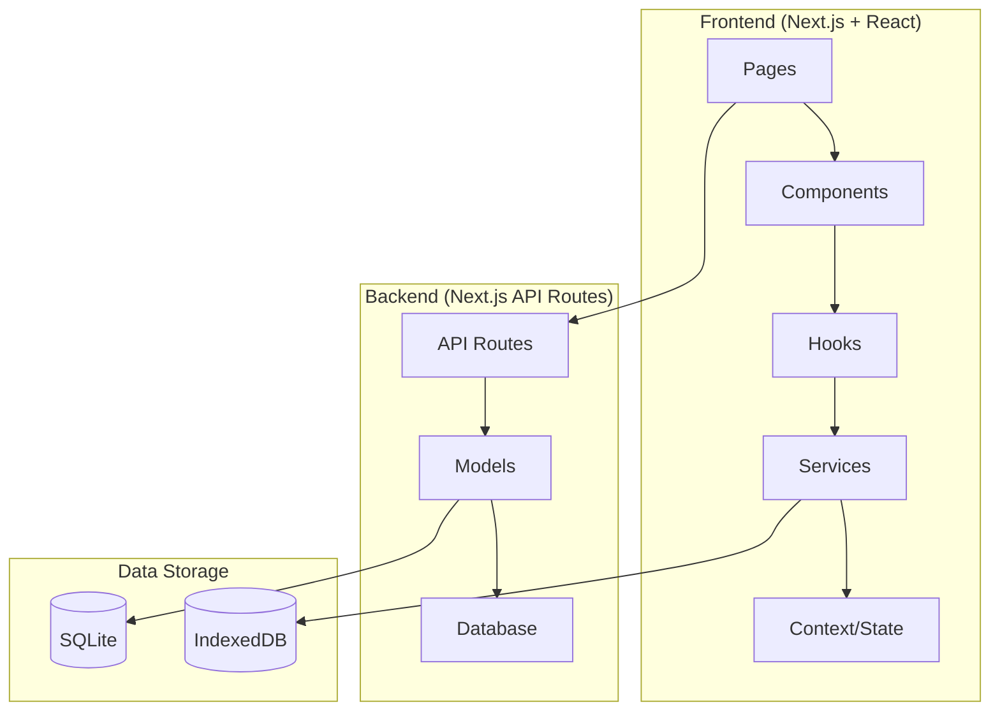
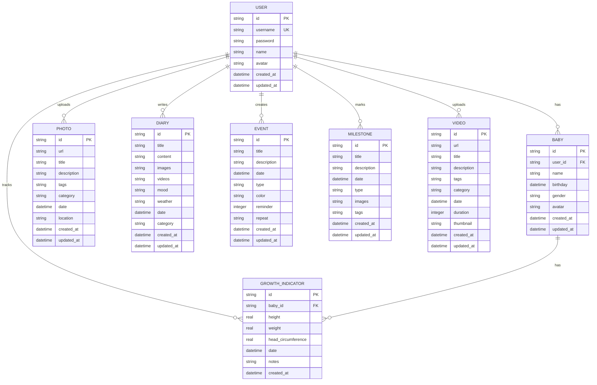

# BabyMemo 技术架构文档

## 1. Architecture Design



## 2. Technology Description

- **Frontend**: React@19 + Next.js@16 + Tailwind CSS@4 + daisyUI@5
- **Styling**: Tailwind CSS with custom color palette and animations
- **Backend**: Next.js API Routes
- **Database**: SQLite (server-side) + IndexedDB (client-side)
- **Authentication**: JWT with bcryptjs
- **Icons**: Lucide React
- **Build Tool**: Next.js Turbopack

## 3. Route Definitions

| Route | Purpose |
|-------|---------|
| / | Home/Dashboard page |
| /photos | Photo wall and gallery |
| /diaries | Creative diary management |
| /calendar | Calendar and events |
| /timeline | Timeline view of milestones |
| /babies | Baby profile management |
| /growth | Growth indicators and charts |
| /videos | Video gallery |
| /settings | Settings and preferences |
| /api/users | User authentication API |
| /api/photos | Photo management API |
| /api/diaries | Diary management API |
| /api/events | Event management API |
| /api/milestones | Milestone management API |
| /api/babies | Baby profile API |
| /api/growth | Growth indicators API |
| /api/videos | Video management API |
| /api/settings | Settings API |
| /api/export | Data export/import API |

## 4. API Definitions

```typescript
// User API
interface User {
  id: string;
  username: string;
  name: string;
  avatar?: string;
  created_at: Date;
}

interface AuthResponse {
  status: 'success' | 'error';
  message?: string;
  data?: {
    user: User;
    token: string;
  };
}

// Photo API
interface Photo {
  id: string;
  url: string;
  title?: string;
  description?: string;
  tags?: string[];
  category?: string;
  date: Date;
  location?: string;
  created_at: Date;
}

// Diary API
interface Diary {
  id: string;
  title: string;
  content: string;
  images?: string[];
  videos?: string[];
  mood?: string;
  weather?: string;
  date: Date;
  category?: string;
  created_at: Date;
}

// Event API
interface Event {
  id: string;
  title: string;
  description?: string;
  date: Date;
  type?: string;
  color?: string;
  reminder?: boolean;
  repeat?: string;
  created_at: Date;
}

// Milestone API
interface Milestone {
  id: string;
  title: string;
  description?: string;
  date: Date;
  type?: string;
  images?: string[];
  tags?: string[];
  created_at: Date;
}

// Baby API
interface Baby {
  id: string;
  user_id: string;
  name: string;
  birthday: Date;
  gender?: string;
  avatar?: string;
  created_at: Date;
}

// Growth API
interface GrowthIndicator {
  id: string;
  baby_id: string;
  height?: number;
  weight?: number;
  head_circumference?: number;
  date: Date;
  notes?: string;
  created_at: Date;
}

// Video API
interface Video {
  id: string;
  url: string;
  title?: string;
  description?: string;
  tags?: string[];
  category?: string;
  date: Date;
  duration?: number;
  thumbnail?: string;
  created_at: Date;
}
```

## 5. Data Model

### 5.1 Data Model Definition



### 5.2 Design System Configuration

```javascript
// tailwind.config.js
module.exports = {
  content: [
    "./pages/**/*.{js,ts,jsx,tsx}",
    "./components/**/*.{js,ts,jsx,tsx}",
  ],
  theme: {
    extend: {
      colors: {
        coral: '#FF6B6B',
        mint: '#4ECDC4',
        yellow: '#FFE66D',
        lavender: '#E2D1F9',
        sky: '#A7DBD8',
        peach: '#FFDAB9',
        cream: '#FFF8F0',
      },
      fontFamily: {
        quicksand: ['Quicksand', 'sans-serif'],
        poppins: ['Poppins', 'sans-serif'],
      },
      animation: {
        'float': 'float 6s ease-in-out infinite',
        'bounce-slow': 'bounce 3s infinite',
        'fade-in-up': 'fadeInUp 0.6s ease-out',
        'pulse-soft': 'pulse 4s ease-in-out infinite',
      },
      keyframes: {
        float: {
          '0%, 100%': { transform: 'translateY(0px)' },
          '50%': { transform: 'translateY(-20px)' },
        },
        fadeInUp: {
          '0%': { opacity: '0', transform: 'translateY(20px)' },
          '100%': { opacity: '1', transform: 'translateY(0)' },
        },
      },
    },
  },
  plugins: [require("daisyui")],
  daisyui: {
    themes: [
      {
        babymemo: {
          "primary": "#FF6B6B",
          "secondary": "#4ECDC4",
          "accent": "#FFE66D",
          "neutral": "#FFF8F0",
          "base-100": "#ffffff",
        },
      },
    ],
  },
}
```
